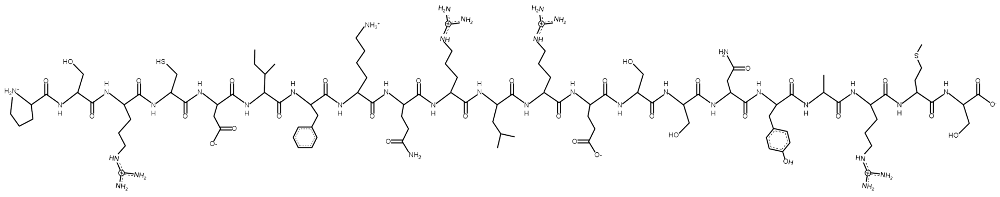

# Generating the header image

Using the website at [http://dulbrich.is2.byuh.edu/dna/](http://dulbrich.is2.byuh.edu/dna/), translate text into ascii encoded DNA.

```
> bricobio
aGGacaTccGGGcaTaaTTcGacGaTTcccTGaGTcGTTGcTTaaaTcaGTcGcaTcTGcTGGG
```

Take this string to [web.expasy.org/translate](web.expasy.org/translate)

```
> aGGacaTccGGGcaTaaTTcGacGaTTcccTGaGTcGTTGcTTaaaTcaGTcGcaTcTGcTGGG
5'3' Frame 1
R T S G H N S T I P Stop V V A Stop I S R I C W
5'3' Frame 2
G H P G I I R R F P E S L L K Stop V A S A G
5'3' Frame 3
D I R A Stop F D D S L S R C L N Q S H L L
3'5' Frame 1
P S R C D Stop F K Q R L R E S S N Y A R Met S
3'5' Frame 2
P A D A T D L S N D Stop G N R R I Met P G C P
3'5' Frame 3
```

Chose 3'5' Frame 1 to work with.
> `3'5' Frame 1`

> `P S R C D Stop F K Q R L R E S S N Y A R Met S`

substituted Stop for I --> 

> P S R C D I F K Q R L R E S S N Y A R Met S

and convert back into FASTA

```
> bricobio
PSRCDIFKQRLRESSNYARMS
```

1. Used [PepDraw](http://www.tulane.edu/~biochem/WW/PepDraw/) from Tulane to generate image.

    

3. Used [Mobyle@RPBS](http://bioserv.rpbs.univ-paris-diderot.fr/PEP-FOLD/) to generate pdb of peptide.
    
    [job link](http://mobyle.rpbs.univ-paris-diderot.fr/data/jobs/PEP-FOLD/C11508706696033)

    

5. use DNA at the [model.it server](http://hydra.icgeb.trieste.it/dna/model_form.html) to generate the bricobio DNA pdb, using all default settings.


	![predicted DNA])./model.it/bricobio-dna-black.png)

6. Transform these into images using Chimera, because the results look great with so much less effort than with PyMol.

7. Clean up in photoshop